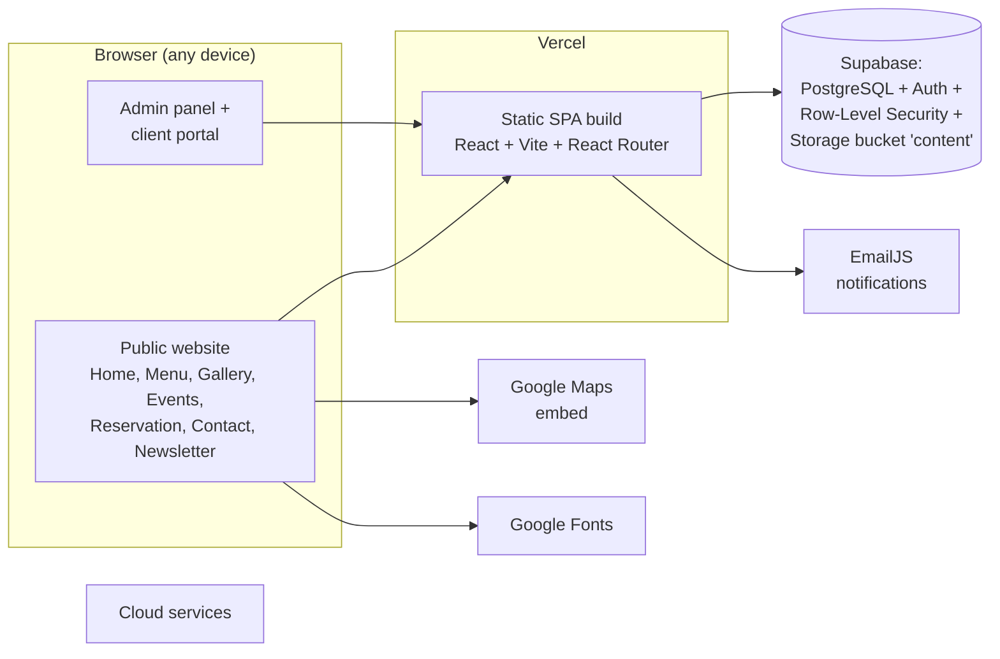
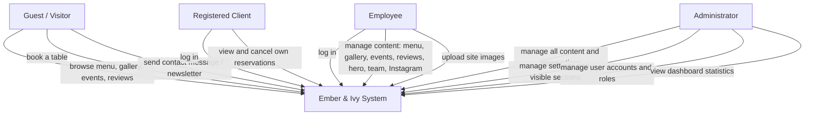
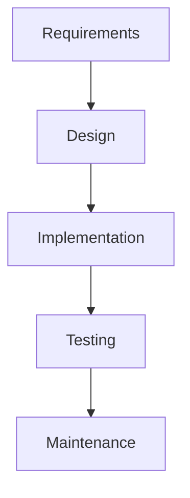
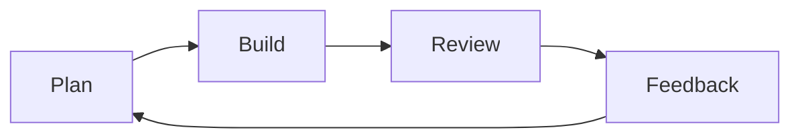
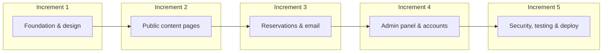
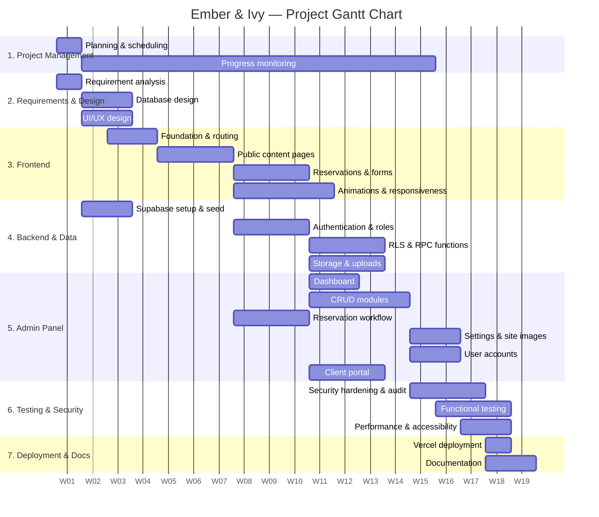

# Final Year Project Proposal

**Project Title:** Ember & Ivy — A Web-Based Café, Restaurant, Event and Reservation Management System

| Field | Value |
|---|---|
| Student Name | [Student Name] |
| Registration Number | [Registration Number] |
| Department | [Department] |
| Faculty | [Faculty] |
| College / University | [College/University] |
| Supervisor | [Supervisor Name] |
| Assignment Due Date | [Due Date] |
| Assignment Submission Date | [Submission Date] |
| Word Count (approx.) | 3,400 |

> I confirm that I understand my coursework needs to be submitted online via My Second Teacher (MST) under the relevant module page before the deadline for my assignment to be accepted and marked. I am fully aware that late submissions will be treated as non-submission and a mark of zero will be awarded.

---

# Table of Contents

1. Introduction ................................................................................................. 1
   1.1 Background / Context ........................................................................... 1
   1.2 Problem Scenario .................................................................................. 2
   1.3 Proposed Solution ................................................................................ 2
2. Aims and Objectives ...................................................................................... 3
   2.1 Aim ........................................................................................................ 3
   2.2 Objectives .............................................................................................. 3
3. Expected Outcomes and Deliverables ............................................................ 4
4. Project Risks, Threats and Contingency Plans .............................................. 5
5. Methodology ................................................................................................. 6
   5.1 Considered Methodologies ...................................................................... 6
   5.2 Selected Methodology: Incremental ........................................................ 7
6. Resource Requirements ............................................................................... 10
7. Work Breakdown Structure ........................................................................... 12
8. Milestones and Deliverables ......................................................................... 13
9. Project Gantt Chart ...................................................................................... 14
10. Conclusion .................................................................................................. 15
11. Bibliography ............................................................................................... 16

---

# List of Figures

- Figure 1: High-Level System Architecture
- Figure 2: Use Case Diagram
- Figure 3: Waterfall Methodology
- Figure 4: Agile Methodology
- Figure 5: Incremental Methodology
- Figure 6: Work Breakdown Structure (WBS)
- Figure 7: Project Gantt Chart

---

# List of Tables

- Table 1: Project Risks, Threats and Contingency Plans
- Table 2: Incremental Development Plan
- Table 3: Milestones and Deliverables
- Table 4: Gantt Schedule (by week)

---

# 1. Introduction

Restaurants and cafés in Nepal traditionally manage their daily operations through manual, paper-based processes: menus are printed and rarely updated, table reservations are taken over the phone and noted in registers, events are announced only through social media, and customer feedback is never systematically recorded. This makes the way a business communicates with its customers slow, uncoordinated, and difficult to analyse, which holds the business back from staying competitive in the experience-driven hospitality market.

This project addresses exactly that gap for **Ember & Ivy**, a premium café, restaurant, cocktail lounge and live music venue located in Lakeside, Pokhara. The project designs and develops a complete web-based management system: a fast, modern public website together with a secure, role-based administrative panel, all in one application.

## 1.1 Background / Context

Hospitality businesses such as Ember & Ivy depend on three things: making customers aware of their food, drinks, and events; converting interest into bookings; and serving customers well so that they return. All three currently rely on offline channels—walk-ins, phone calls, and social media posts—which give the venue no central record of what is happening and no way to measure performance over time.

Modern web technology provides a standard solution. A single-page web application (SPA) served from a static host can deliver a polished public experience while a serverless cloud backend (database, authentication, file storage, and email) handles the data reliably. This combination is cheap to host, quickly updated, and accessible from any device, which makes it an ideal fit for a venue with a small administrative team.

Ember & Ivy's neighbourhood context is also relevant: Lakeside Pokhara is a tourism and hospitality hub where guests and travellers routinely search for venues online, check menus and photos, and book tables before they visit. Without an online presence where the menu, gallery, and events are always current and table booking is one step, the venue misses a large share of walk-by digital discovery. (Pokhara Tourism Council, n.d.)

## 1.2 Problem Scenario

The problems the restaurant faces can be summarised as follows:

- **Manual reservation handling:** table bookings are received by phone during service hours and written into a register. Staff cannot confirm availability instantly, records are easily lost, and the customer has to wait for a response rather than booking instantly.
- **Static and outdated content:** the menu, gallery, live sessions, and event schedule are separate from the website; updating them requires technical skills and is not possible for the owners themselves.
- **No central customer data:** there is no record of who books, how often they visit, how many guests come, or which events are popular, so decisions are made on guesswork rather than evidence.
- **Feedback is invisible:** reviews and suggestions arrive informally (unstructured social messages) and are not collected, displayed, or used for improvement.
- **Poor discoverability and trust:** an outdated or missing website makes the venue appear unprofessional, and guests cannot verify the ambience, popular dishes, or events in advance.
- **No guest self-service:** customers cannot view or modify their own reservations, and staff spend service time answering repetitive calls and messages.

## 1.3 Proposed Solution

The proposed solution is **Ember & Ivy**, a web-based café, restaurant, event and reservation management system consisting of three integrated parts in one application:

- **Public website** (for guests): a responsive, animated single-page application with sections for the home page, menu with category tabs, photo gallery with a lightbox viewer, upcoming and past events with countdowns, customer reviews, the team, Instagram feed, newsletter sign-up, an online table reservation form, and a contact page with a map and email form.
- **Admin panel** (for staff): a protected dashboard where authorised staff manage every piece of content—menu items, categories, gallery images, reviews, events, hero slides, team members and Instagram posts—using generic CRUD (create, read, update, delete) screens, manage incoming reservations with a confirm/cancel workflow, customise site settings and visible sections, upload site images, and view visitor statistics.
- **User accounts and client portal** (for guests of the system): role-based authentication where accounts are assigned one of three roles—*admin*, *employee*, or *client*—and registered clients can view and cancel their own bookings.

The system is built as a React single-page application, backed by **Supabase**, a serverless platform providing a PostgreSQL database, authentication, row-level security, and file storage, with automated email notifications through EmailJS, and is deployed on **Vercel** under the domain `https://emberandivy.com.np`. A built-in demo mode lets the whole site run without a backend for demonstration and testing purposes, while the production build uses the live cloud services.

The high-level architecture of the system is shown in Figure 1, and the main interactions between the different users and the system are shown in the use case diagram in Figure 2.

*Figure 1: High-Level System Architecture*

*Figure 2: Use Case Diagram*

---

# 2. Aims and Objectives

## 2.1 Aim

The primary aim of this project is to design and develop a secure, responsive, web-based café, restaurant, event and reservation management system for Ember & Ivy that gives guests an engaging online experience and gives the venue a central, data-backed way to manage its content, bookings, events, and customer accounts.

## 2.2 Objectives

1. Design a modern, responsive user interface for both the public website and the admin panel.
2. Build dynamic menu, gallery, and events pages that are rendered from database content rather than hard-coded pages.
3. Implement an online table reservation system with input validation, a pending/confirmed/cancelled status workflow, and instant confirmation feedback.
4. Automate email notifications for reservations, contact messages, and newsletter sign-ups using the EmailJS service, with in-app storage as a fallback so no request is ever lost.
5. Implement role-based authentication (admin, employee, client) using Supabase Auth and enforce access at the database level with row-level security.
6. Build a complete admin panel with reusable CRUD modules for every content type, reservation management, site settings, image uploads, and user-account management.
7. Provide a client portal allowing registered guests to view and cancel their own reservations.
8. Harden the application against common web threats—script injection, unauthorised data access, and content security—through input escaping, restricted database policies, and security headers.
9. Deploy the application to a production host and prepare accompanying documentation.

---

# 3. Expected Outcomes and Deliverables

**Expected outcomes** of this project:

- Guests can browse an up-to-date menu, gallery, and event schedule from any device, and can book a table online in under a minute with instant confirmation.
- The venue can update all website content themselves through the admin panel without any technical or programming skills.
- Staff can manage incoming reservations with a clear confirm/cancel workflow and see a complete booking history.
- Registered clients can view and cancel their own reservations without contacting staff.
- The venue gains evidence about visitors, reservations, and event popularity to support business decisions.
- The public site presents a professional, trustworthy image of the brand to guests discovering the venue online.

**Expected deliverables** of this project:

- A fully developed, deployed web application (`https://emberandivy.com.np`) with a public site, admin panel, and client portal.
- Complete, clearly structured source code versioned with Git.
- The database schema and seed script (SQL) that set up all tables, security policies, and starter content.
- A user guide for administrators and staff.
- The final year project report including design, implementation, testing, and evaluation.

---

# 4. Project Risks, Threats and Contingency Plans

**Table 1: Project risks, threats and contingency plans**

| No. | Risk | Impact | Probability | Contingency Plan |
|---|---|---|---|---|
| 1 | Data loss or corruption | High | Medium | Regular automated backups with Supabase; export key tables; keep seed data so the site can be re-populated. |
| 2 | Cloud service outage (database or hosting) | Medium | Medium | Data hosted on Supabase and deployed on Vercel, both with high-availability guarantees; built-in demo mode keeps the site usable offline; monitor service status. |
| 3 | Email delivery failure | Medium | Low | Every request is stored in the database first; if EmailJS fails the record remains visible in the admin panel and is never silently lost. |
| 4 | Security breach or unauthorised access | High | Low | Row-level security on every table, role-based access, input escaping, restricted secrets, and Content-Security-Policy headers. |
| 5 | Scope creep and changing requirements | Medium | Medium | Incremental delivery with fixed increments; new requests are reviewed against remaining schedule and prioritised. |
| 6 | Schedule overrun | High | Medium | Milestones reviewed weekly; the most important features are built first so a usable product is available early. |
| 7 | Developer device failure | Medium | Low | All work committed to Git daily and pushed to GitHub; project files mirrored to cloud storage. |
| 8 | Unresolved technical dependency | Medium | Low | Prefer mature, widely used technologies (React, Supabase, Vite); isolate risky integrations behind small service modules. |

---

# 5. Methodology

## 5.1 Considered Methodologies

### 5.1.1 Waterfall Methodology

The Waterfall model is a linear-sequential life-cycle model in which each phase—requirements, design, implementation, testing, and maintenance—must be completed before the next begins, and phases do not overlap. It provides a clear structure and is easy to monitor (Lutkevich, 2022).

*Figure 3: Waterfall Methodology*

**Advantages**

- Clear structure with well-defined phases.
- Easy to track progress and manage.
- Simple to understand for small, fully understood projects.

**Disadvantages**

- Inflexible: it is difficult to update requirements once a phase is finished.
- Risk of delivering a late product if the initial requirements were wrong.
- Testing happens only at the end, so errors are found late and expensive to fix.

### 5.1.2 Agile Methodology

Agile is an iterative methodology that builds a product in short cycles called sprints, continuously collecting feedback from customers and improving the plan for the next sprint (Laoyan, 2024).

*Figure 4: Agile Methodology*

**Advantages**

- Highly flexible and responsive to change.
- Delivers working features quickly.
- Regular customer feedback keeps the product aligned with expectations.

**Disadvantages**

- Requires frequent customer involvement, which is not guaranteed for a solo student project.
- Without a fixed plan, scope and completion time can drift.
- Heavy ceremony (stand-ups, sprint reviews) is overkill for a single developer.

## 5.2 Selected Methodology: Incremental Methodology

The incremental model divides a project into small, manageable increments, each building on the previous one and adding value to the product (Anon., 2023). This matches the nature of the project: the site can be built feature-set by feature-set, with every increment delivering something visible, testable, and usable.

*Figure 5: Incremental Methodology*

The incremental methodology was chosen over Waterfall and Agile because:

- The project requirements will naturally evolve during development; incremental delivery and early client feedback is supported by constant testing.
- Each increment is tested before the next begins, which reduces risk significantly.
- Core features (browsing the menu, booking a table) are delivered first, so a usable product is ready early even if later increments slip.
- Continuous testing in each increment produces a higher-quality final product.
- It fits a solo student schedule better than the ceremony of full Agile, while remaining more flexible than Waterfall.

### 5.2.1 Incremental Development Plan

**Table 2: Incremental development plan**

| Increment | Scope | Key Deliverable |
|---|---|---|
| 1 | Project setup, database design, UI/UX design | Vite + React foundation, Supabase schema and seed, design system and wireframes |
| 2 | Public content pages | Home, menu, gallery, events, team, reviews, Instagram sections as dynamic DB-driven pages |
| 3 | Reservations and communication | Online reservation form, admin reservation workflow, EmailJS notifications, client portal |
| 4 | Admin panel and accounts | Authentication, roles, reusable CRUD modules, settings, image uploads, user management, dashboard |
| 5 | Security, testing, deployment | Security hardening and audit, functional testing, Vercel deployment, documentation |

---

# 6. Resource Requirements

For the development of the Ember & Ivy system, the following resources are required.

**Hardware**

- A laptop or desktop computer with at least an Intel/AMD 64-bit processor, 4 GB RAM (8 GB recommended), and 256 GB of disk space, running Windows or Linux.
- A smartphone or tablet for responsive testing.

**Software tools**

- **Visual Studio Code** — free, open-source code editor used for writing and debugging all source code.
- **Git and GitHub** — version control for tracking every change and hosting the source repository.
- **Node.js (LTS) with npm** — JavaScript runtime and package manager required by the React/Vite toolchain.
- **Chrome DevTools / Microsoft Edge** — browser developer tools used for layout debugging, performance, and accessibility checks.
- **Figma** — cloud-based design tool used to design the user interface and page layouts before development.
- **Postman** — for testing the backend API endpoints and authorization/security behaviour during development.

**Programming languages and libraries**

- **React 18** — JavaScript library for building the user interface as reusable components.
- **Vite 5** — fast build tool and development server; configured with the React plugin.
- **React Router 7** — client-side routing for the public pages and the admin panel.
- **Framer Motion** — animation library for the scroll reveals, fades, and interactive transitions on the public site.
- **@supabase/supabase-js** — client SDK for interacting with the Supabase database, authentication, and storage.
- **@emailjs/browser** — client library used to send email notifications without a dedicated SMTP server.
- **PostgreSQL** — relational database provided by Supabase; all data is stored in a single Postgres instance.

**Cloud services**

- **Supabase** — provides the PostgreSQL database, user authentication (both email/password accounts and third-party providers), row-level security, and file storage for uploaded images in a public `content` bucket.
- **EmailJS** — sends reservation confirmation, contact, and newsletter emails from the browser.
- **Vercel** — hosting and continuous deployment of the single-page application, including SPA rewrite rules and security headers.
- **Google Maps Embed** — map on the Contact page.
- **Google Fonts** — typography for the site.

**Other**

- Microsoft Word (or equivalent) for the proposal, report, and documentation.
- Supabase SQL Editor and Vercel dashboard for database configuration and production deployment.

---

# 7. Work Breakdown Structure

The work breakdown structure of the project is presented below in the form of a WBS diagram.

```mermaid
flowchart TD
  EB[Ember & Ivy System] --> PM[1. Project Management]
  EB --> RD[2. Requirements and Design]
  EB --> FE[3. Frontend Development]
  EB --> BE[4. Backend and Data]
  EB --> AP[5. Admin Panel]
  EB --> TE[6. Testing and Security]
  EB --> DE[7. Deployment and Documentation]

  PM --> P1[1.1 Planning and scheduling]
  PM --> P2[1.2 Progress monitoring and reporting]

  RD --> R1[2.1 Requirement analysis]
  RD --> R2[2.2 Database design and schema]
  RD --> R3[2.3 UI/UX design and wireframes]

  FE --> F1[3.1 App foundation and routing]
  FE --> F2[3.2 Public pages: Home, Menu, Gallery, Events]
  FE --> F3[3.3 Reservation, contact and newsletter forms]
  FE --> F4[3.4 Animations and responsive design]

  BE --> B1[4.1 Supabase setup, schema and seed]
  BE --> B2[4.2 Authentication and roles]
  BE --> B3[4.3 Row-level security and RPC functions]
  BE --> B4[4.4 Image storage and uploads]

  AP --> A1[5.1 Dashboard and statistics]
  AP --> A2[5.2 CRUD modules for all content]
  AP --> A3[5.3 Reservation management workflow]
  AP --> A4[5.4 Settings and site images]
  AP --> A5[5.5 User account management]
  AP --> A6[5.6 Client portal]

  TE --> T1[6.1 Functional and acceptance testing]
  TE --> T2[6.2 Security hardening and audit]
  TE --> T3[6.3 Performance and accessibility checks]

  DE --> D1[7.1 Vercel deployment and domain]
  DE --> D2[7.2 User guide and documentation]
```

*Figure 6: Work Breakdown Structure (WBS)*

---

# 8. Milestones and Deliverables

Project milestones are reference points in the project's life cycle representing the completion of major stages, used to carefully examine continuous progress and guarantee the project stays on track (Donato, 2023).

**Table 3: Milestones and deliverables**

| Milestone | Description | End of Week | Deliverable |
|---|---|---|---|
| M1 | Project plan and requirements approved | 1 | Approved proposal, requirement list |
| M2 | Database schema and UI design ready | 3 | SQL schema and seed script, wireframes |
| M3 | Public content pages complete | 6 | Live menu, gallery, events, home sections |
| M4 | Online reservation flow complete | 9 | Reservation form, admin workflow, email notifications |
| M5 | Admin panel and user accounts complete | 12 | CRUD modules, settings, uploads, user management |
| M6 | Security hardening and testing complete | 14 | Security audit report, test results |
| M7 | Production deployment and documentation | 15 | Live production site, user guide |

---

# 9. Project Gantt Chart

*Figure 7: Project Gantt Chart*

The timeline for the Ember & Ivy project is presented in the Gantt chart above. The project follows the incremental model from planning to deployment across approximately 15 weeks; each increment focuses on one major area—design and foundation, public content, reservations, the admin panel, and finally security and deployment—so that a usable product exists from early in the schedule.

**Table 4: Gantt schedule (by week)**

| Activity | W1 | W2 | W3 | W4 | W5 | W6 | W7 | W8 | W9 | W10 | W11 | W12 | W13 | W14 | W15 |
|---|:-:|:-:|:-:|:-:|:-:|:-:|:-:|:-:|:-:|:-:|:-:|:-:|:-:|:-:|:-:|
| Planning & scheduling | x | | | | | | | | | | | | | | |
| Requirement analysis | x | | | | | | | | | | | | | | |
| Database design & schema | | x | x | | | | | | | | | | | | |
| UI/UX design | | x | x | | | | | | | | | | | | |
| App foundation & routing | | | | x | x | | | | | | | | | | |
| Supabase setup & seed | | | x | x | | | | | | | | | | | |
| Public content pages | | | | | x | x | x | | | | | | | | |
| Reservations & forms | | | | | | | | x | x | x | | | | | |
| Authentication & roles | | | | | | | | x | x | x | | | | | |
| Reservation workflow (admin) | | | | | | | | x | x | x | | | | | |
| Animations & responsiveness | | | | | | | | | x | x | x | | | | |
| Client portal | | | | | | | | | | x | x | x | | | |
| Admin CRUD modules | | | | | | | | | | x | x | x | | | |
| RLS & RPC functions | | | | | | | | | | x | x | x | | | |
| Storage & uploads | | | | | | | | | | x | x | x | | | |
| Dashboard & statistics | | | | | | | | | | | x | x | | | |
| Settings & site images | | | | | | | | | | | | x | x | | |
| User accounts | | | | | | | | | | | | x | x | | |
| Security hardening & audit | | | | | | | | | | | | | x | x | |
| Functional testing | | | | | | | | | | | | | x | x | |
| Performance & accessibility | | | | | | | | | | | | | | x | x |
| Vercel deployment | | | | | | | | | | | | | | | x |
| Documentation | | | | | | | | | | | | | | | x |

---

# 10. Conclusion

The problem at the heart of this project is not a shortage of tasty food or good events, but a gap between a venue like Ember & Ivy and the digital way its guests discover and book venues today. The manual, paper-based handling of reservations, static content, and invisible feedback holds the business back from operating efficiently and growing its customer base.

The proposed web-based management system answers these problems with a single, integrated application. Guests get a modern, responsive website where the menu, gallery, events, and reviews are always current, and where booking a table takes under a minute. Staff get a secure admin panel in which every piece of content, reservation, setting, image, and user account can be managed without writing a line of code. The client portal gives registered guests self-service over their own bookings, and the underlying database gives the venue the evidence it previously lacked.

By selecting the incremental methodology, the project is delivered in tested, usable stages so that risk is controlled and a working product is available early. The chosen technology stack—React for the interface, Supabase for a secure and modern backend with row-level security, EmailJS for notifications, and Vercel for reliable hosting—fulfils modern technical requirements while keeping running costs minimal. In its final form, Ember & Ivy will not only serve as a successful online presence for the venue but also a foundation that can be extended with new features in the future, such as online payments or a wider marketing dashboard.

---

# 11. Bibliography

Anon., 2022. *Incremental Model in Software Engineering*. [Online]
Available at: https://www.interviewbit.com/blog/incremental-model/
[Accessed 20 September 2026].

Donato, H., 2023. *What Are Milestones in Project Management?*. [Online]
Available at: https://project-management.com/what-are-milestones/
[Accessed 20 September 2026].

Laoyan, S., 2024. *What is Agile methodology? (A beginner's guide)*. [Online]
Available at: https://asana.com/resources/agile-methodology
[Accessed 20 September 2026].

Lutkevich, B., 2022. *Waterfall Model*. [Online]
Available at: https://www.techtarget.com/searchsoftwarequality/definition/waterfall-model
[Accessed 20 September 2026].

Mandić, M., 2023. *Introduction to Row-Level Security*. [Online]
Available at: https://www.postgresql.org/docs/current/ddl-rowsecurity.html
[Accessed 20 September 2026].

Meta Platforms, 2024. *React – A JavaScript library for building user interfaces*. [Online]
Available at: https://react.dev/
[Accessed 20 September 2026].

Open Source Matters, n.d. *Vite – Next Generation Frontend Tooling*. [Online]
Available at: https://vite.dev/
[Accessed 20 September 2026].

Pokhara Tourism Council, n.d. *About Us — Organization Representing the Tourism Industry of Pokhara*. [Online]
Available at: https://www.pokharatourism.org.np/about-us/
[Accessed 20 September 2026].

React Router Authors, 2024. *React Router – Declarative routing for React*. [Online]
Available at: https://reactrouter.com/
[Accessed 20 September 2026].

Supabase Inc., 2024. *Supabase Documentation – Auth, Database and Storage*. [Online]
Available at: https://supabase.com/docs
[Accessed 20 September 2026].

Vercel Inc., 2024. *Vercel Documentation – Deploying Frontend Applications*. [Online]
Available at: https://vercel.com/docs
[Accessed 20 September 2026].